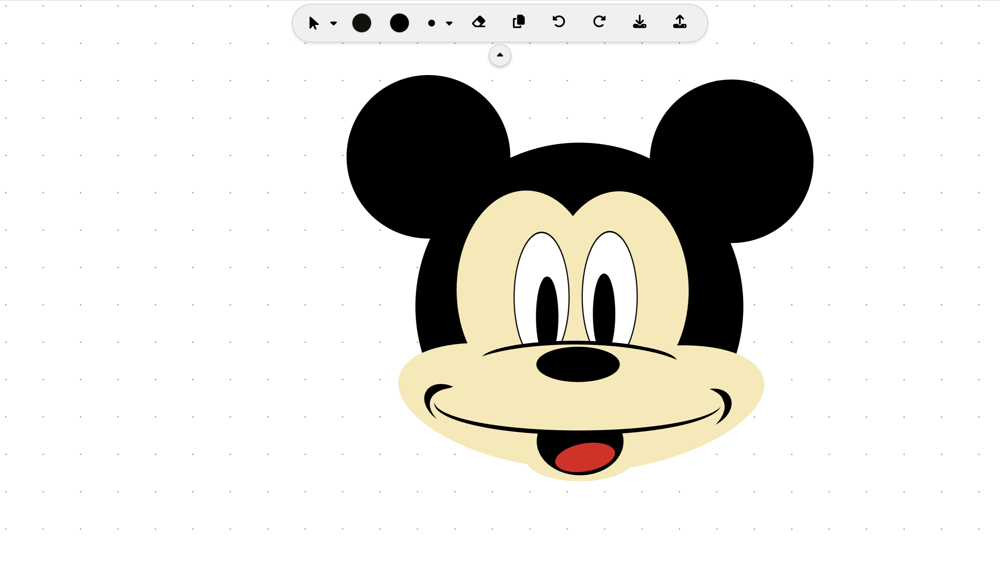

# Web Based Paint Application


This is Our Third Assignment in Design Patterns Course (CSED27 Alexandria University)

## `🌟`Project Objectives

- Design an object-oriented model for geometric shapes.
- Draw a UML class diagram that represents your model.
- Apply the OOP concepts of inheritance and polymorphism to your design.
- Create an advanced UI with 2D Graphics capabilities.
- Dealing with JSON for requests and responses handling.

## `📜`Project Description

A web Application that has all the features of any paint application beside saving and loading the files in 2 formats.

## `🔧`Technologies Used

### Frontend

- [React](https://reactjs.org/): For building a dynamic and responsive user interface.
- [React-Konva](https://konvajs.org/docs/react/): For advanced canvas manipulation.
- [React-Color](https://casesandberg.github.io/react-color/): For a user-friendly color picker.
- [FontAwesome](https://fontawesome.com/): For visually appealing icons.
- [Axios](https://axios-http.com/): For making HTTP requests to the backend.

### Backend

- [Spring Boot](https://spring.io/projects/spring-boot): For managing RESTful APIs and handling backend logic.

### Data Format

- JSON: Drawings are saved as JSON files for easy storage and reusability.

## `🛠️`Setup and Installation

### Prerequisites

- **Node.js** and **npm** installed.
- **Java JDK 11** or higher installed.

### Steps

#### Frontend

1. Clone the repository:

   ```bash
   git clone https://github.com/omarzydan610/Paint.git  
   cd Paint/frontend  
   ```
2. Install dependencies:

   ```bash
   npm install  
   ```
3. Start the development server:

   ```bash
   npm start  
   ```

   The application will be available at `http://localhost:3000`.

#### Backend

1. Navigate to the backend directory:

   ```bash
   cd ../backend  
   ```
2. Build the Spring Boot application:

   ```bash
   ./mvnw package  
   ```
3. Run the backend server:

   ```bash
   java -jar target/paint-application.jar  
   ```

   The backend server will run at `http://localhost:8080`.

## `🚀`System Features

- Advanced UI with 2D capabilities
- Free hand drawing
- Geometric shapes drawing
- shapes modifications
  - Draw
  - Delete
  - Move
  - ReColor
  - ReSize
  - Rotate
  - Duplicate
- Undo & Redo
- Save & Load using 2 different file types (XML, JSON)

## Implemented Design Patterns

- Factory Design Pattern
- Prototype Design Pattern
- Command Design Pattern
- Dependency Injection (springboot)
- Singleton Pattern (springboot)

## Demo

[Demo](https://github.com/omarzydan610/Paint/blob/main/Assets/Demo.mp4)

### For more detalied information check [Project Report](https://github.com/omarzydan610/Paint/blob/main/Project%20Report.pdf)
