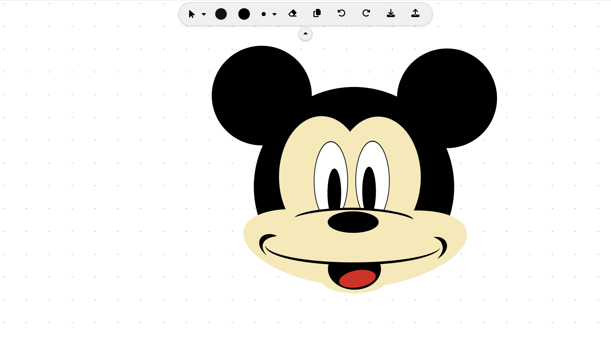

# Web Based Paint Application

This is Out Third Assignment in Design Patterns Course (CSED27 Alexandria University)

## Project Objectives

- Design an object-oriented model for geometric shapes.
- Draw a UML class diagram that represents your model.
- Apply the OOP concepts of inheritance and polymorphism to your design.
- Create an advanced UI with 2D Graphics capabilities.
- Dealing with JSON for requests and responses handling.

## Description

A web Application that has all the features of any paint application beside saving and loading the files in 2 formats.

## System features

- Advanced UI with 2D capabilities
- Free hand drawing
- Geometric shapes drawing
- shapes modifications
  - Draw
  - Delete
  - Move
  - ReColor
  - ReSize
  - Rotate
  - Duplicate
- Undo & Redo
- Save & Load using 2 different file types (XML, JSON)

## Implemented Design Patterns

- Factory Design Pattern
- Prototype Design Pattern
- Command Design Pattern
